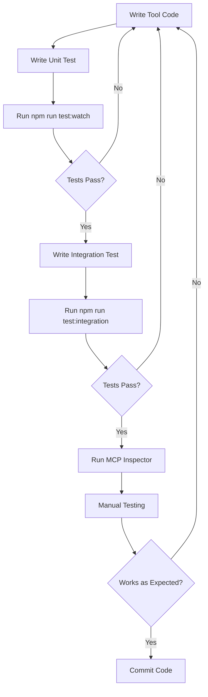

# Google Drive MCP Server - Testing Strategy

## Overview

This document outlines the comprehensive testing strategy for the Google Drive MCP server, particularly focused on the new multi-tier API architecture (low-level 1:1 API mappings + high-level composite tools).

## Testing Philosophy

**Goal**: Ensure Claude CLI is never blocked while maintaining confidence in all tool implementations.

**Key Principles**:
1. **Complete API Coverage** - Every Google API operation has a tested tool
2. **Protocol Compliance** - All tools conform to MCP specification
3. **Security First** - Validate against injection attacks and data leaks
4. **Real-world Testing** - Use actual Google Drive APIs in integration tests
5. **Fast Feedback** - Unit tests complete in <10s, integration tests in <60s

---

## Testing Layers

### Layer 1: Unit Tests (Fast, Isolated)
**What**: Test individual tool logic without external dependencies
**Tools**: Vitest + Google API Mocks
**Coverage Target**: 80% code coverage
**Run Time**: <10 seconds

### Layer 2: Integration Tests (Real APIs)
**What**: Test tools against real Google Drive/Docs/Sheets/Slides APIs
**Tools**: Vitest + Real OAuth credentials + Test files
**Coverage Target**: All critical paths
**Run Time**: <60 seconds

### Layer 3: Protocol Conformance (MCP Spec)
**What**: Validate MCP protocol compliance
**Tools**: `@modelcontextprotocol/conformance`
**Coverage Target**: 100% MCP spec compliance
**Run Time**: <5 seconds

### Layer 4: End-to-End Tests (Real Usage)
**What**: Test complete workflows with MCP Inspector and Claude
**Tools**: MCP Inspector + Manual testing
**Coverage Target**: All user-facing workflows
**Run Time**: Manual testing sessions

### Layer 5: Security & Performance
**What**: Validate security posture and performance characteristics
**Tools**: Custom security tests + k6 load testing
**Coverage Target**: OWASP Top 10 + <500ms response times
**Run Time**: <30 seconds (security), variable (performance)

---

## Testing Infrastructure Setup

### 1. Install Testing Dependencies

```bash
# Core testing framework
npm install --save-dev vitest @vitest/ui c8

# MCP testing tools
npm install --save-dev @haakco/mcp-testing-framework
npm install --save-dev @modelcontextprotocol/conformance

# Security testing
npm install --save-dev @side/jest-runtime

# Performance testing
npm install --save-dev k6

# CI/CD tools
npm install --save-dev husky lint-staged
```

### 2. Create Test Directory Structure

```
tests/
├── unit/
│   ├── schemas/              # Zod schema validation tests
│   │   ├── docs.test.ts
│   │   ├── sheets.test.ts
│   │   └── slides.test.ts
│   ├── tools/                # Tool logic tests (mocked APIs)
│   │   ├── docs-lowlevel.test.ts
│   │   ├── docs-highlevel.test.ts
│   │   ├── sheets-lowlevel.test.ts
│   │   └── slides-lowlevel.test.ts
│   └── helpers/              # Utility function tests
│       ├── path-resolution.test.ts
│       └── a1-notation.test.ts
├── integration/
│   ├── google-apis/          # Real Google API tests
│   │   ├── docs.integration.test.ts
│   │   ├── sheets.integration.test.ts
│   │   └── slides.integration.test.ts
│   ├── mcp-protocol/         # MCP client-server tests
│   │   └── server.integration.test.ts
│   └── workflows/            # Multi-tool workflow tests
│       └── document-automation.test.ts
├── conformance/
│   └── mcp-spec.test.ts      # Protocol conformance tests
├── security/
│   ├── injection.test.ts     # SQL/command injection tests
│   ├── auth.test.ts          # OAuth security tests
│   └── data-leaks.test.ts    # Sensitive data exposure tests
├── performance/
│   └── load.test.ts          # k6 load testing scripts
├── fixtures/                 # Test data
│   ├── mock-responses/
│   │   ├── docs.json
│   │   ├── sheets.json
│   │   └── slides.json
│   └── test-files.json       # Real Google Drive test file IDs
└── helpers/                  # Test utilities
    ├── mcp-client.ts         # MCP client test harness
    ├── google-mocks.ts       # Google API mock factories
    └── assertions.ts         # Custom matchers
```

### 3. Configuration Files

**vitest.config.ts**:
```typescript
import { defineConfig } from 'vitest/config';

export default defineConfig({
  test: {
    globals: true,
    environment: 'node',
    coverage: {
      provider: 'c8',
      reporter: ['text', 'json', 'html', 'lcov'],
      exclude: [
        'dist/**',
        'scripts/**',
        '**/*.config.ts',
        'tests/**',
      ],
      lines: 80,
      functions: 80,
      branches: 75,
      statements: 80,
    },
    testTimeout: 10000, // 10s for unit tests
  },
});
```

**vitest.integration.config.ts**:
```typescript
import { defineConfig } from 'vitest/config';

export default defineConfig({
  test: {
    globals: true,
    environment: 'node',
    include: ['tests/integration/**/*.test.ts'],
    testTimeout: 60000, // 60s for integration tests
  },
});
```

**.mcp-test.json**:
```json
{
  "serverPath": "./dist/index.js",
  "coverage": {
    "enabled": true,
    "threshold": {
      "lines": 80,
      "functions": 80,
      "branches": 75,
      "statements": 80
    }
  },
  "performance": {
    "maxResponseTime": 500,
    "maxMemoryUsage": "512MB"
  },
  "outputFormats": ["console", "json", "junit"],
  "parallel": true
}
```

**.env.test**:
```bash
# OAuth-Protected Test Documents (for local testing)
TEST_DOCUMENT_ID_OAUTH=1CIeAIWDqN_s1g9b7V2h79VpFjlrPM15VYuZ09zsNM9w
TEST_FOLDER_ID_OAUTH=1hPToIm_EVEbJIVufHgz3aC_8cL4aeMBq
TEST_SPREADSHEET_ID_OAUTH=TBD
TEST_PRESENTATION_ID_OAUTH=TBD

# Public/Service Account Test Documents (for CI/CD)
TEST_DOCUMENT_ID_PUBLIC=18iVsRPn2L49sJtbgyvE3sakRG3v3mY--s4z5nPkghaI
TEST_FOLDER_ID_PUBLIC=1dy_gOwhrpgyKv_cGRO44a1AmXo45v4e3
TEST_SPREADSHEET_ID_PUBLIC=TBD
TEST_PRESENTATION_ID_PUBLIC=TBD

# OAuth credentials for testing (local development)
GOOGLE_DRIVE_OAUTH_CREDENTIALS=/Users/clintgossett/Documents/Applied\ Frameworks/projects/af-product-marketing-claude/projects/google-drive-integration/.credentials/gcp-oauth.keys.json
GOOGLE_DRIVE_MCP_TOKEN_PATH=~/.config/google-drive-mcp/tokens.json

# Service account credentials (CI/CD)
GOOGLE_SERVICE_ACCOUNT_KEY='{"type":"service_account",...}'
# OR
GOOGLE_SERVICE_ACCOUNT_KEY_PATH=/path/to/service-account.json

# Feature flags
ENABLE_INTEGRATION_TESTS=true
ENABLE_PERFORMANCE_TESTS=false
```

### 4. Update package.json Scripts

```json
{
  "scripts": {
    "typecheck": "tsc --noEmit",
    "build": "npm run typecheck && node scripts/build.js",
    "start": "node dist/index.js",
    "auth": "node dist/index.js auth",
    "watch": "node scripts/build.js --watch",
    "prepare": "npm run build",

    "test": "npm run test:unit && npm run test:conformance",
    "test:unit": "vitest run tests/unit",
    "test:integration": "vitest run --config vitest.integration.config.ts",
    "test:conformance": "npx @modelcontextprotocol/conformance server --command 'node dist/index.js'",
    "test:security": "vitest run tests/security",
    "test:performance": "k6 run tests/performance/load.test.ts",
    "test:all": "npm run test:unit && npm run test:integration && npm run test:conformance && npm run test:security",

    "test:watch": "vitest",
    "test:ui": "vitest --ui",
    "test:coverage": "vitest run --coverage",

    "test:mcp-framework": "mcp-test test ./dist/index.js --coverage --threshold '{\"lines\": 80}'",
    "test:generate": "mcp-test generate ./dist/index.js --output ./tests/generated",

    "lint": "tsc --noEmit",
    "ci": "npm run typecheck && npm run test:all && npm run test:coverage"
  }
}
```

---

## Testing Workflows

### Development Workflow



### Pre-Commit Workflow

```bash
# Automated via husky pre-commit hook
1. npm run typecheck      # TypeScript validation
2. npm run lint           # Linting
3. npm run test:unit      # Fast unit tests
4. npm run test:conformance # MCP protocol validation
```

### CI/CD Workflow (GitHub Actions)

```yaml
# .github/workflows/test.yml
name: Test Suite
on: [push, pull_request]

jobs:
  unit-tests:
    runs-on: ubuntu-latest
    steps:
      - uses: actions/checkout@v3
      - uses: actions/setup-node@v3
      - run: npm install
      - run: npm run typecheck
      - run: npm run test:unit
      - run: npm run test:coverage
      - uses: codecov/codecov-action@v3

  integration-tests:
    runs-on: ubuntu-latest
    env:
      GOOGLE_DRIVE_OAUTH_CREDENTIALS: ${{ secrets.TEST_OAUTH_CREDENTIALS }}
      TEST_DOCUMENT_ID: ${{ secrets.TEST_DOCUMENT_ID }}
    steps:
      - uses: actions/checkout@v3
      - uses: actions/setup-node@v3
      - run: npm install
      - run: npm run build
      - run: npm run test:integration

  conformance-tests:
    runs-on: ubuntu-latest
    steps:
      - uses: actions/checkout@v3
      - uses: actions/setup-node@v3
      - run: npm install
      - run: npm run build
      - run: npm run test:conformance

  security-tests:
    runs-on: ubuntu-latest
    steps:
      - uses: actions/checkout@v3
      - uses: actions/setup-node@v3
      - run: npm install
      - run: npm run test:security
```

### Release Workflow

```bash
# Before publishing to npm
1. npm run test:all           # All automated tests
2. npm run test:coverage      # Verify coverage thresholds
3. Manual testing with MCP Inspector
4. Manual testing with Claude Desktop
5. Update version in package.json
6. npm publish
```

---

## Test Writing Guidelines

### Unit Test Example (Low-Level Tool)

```typescript
// tests/unit/tools/docs-lowlevel.test.ts
import { describe, it, expect, vi, beforeEach } from 'vitest';
import { google } from 'googleapis';
import { docsInsertTextTool } from '../../../src/tools/docs/lowlevel';

// Mock Google APIs
vi.mock('googleapis');

describe('docs_insertText Tool', () => {
  let mockDocs: any;

  beforeEach(() => {
    mockDocs = {
      documents: {
        batchUpdate: vi.fn(),
      },
    };
    vi.mocked(google.docs).mockReturnValue(mockDocs);
  });

  it('validates input schema correctly', async () => {
    const validInput = {
      documentId: 'doc-123',
      index: 1,
      text: 'Hello World',
    };

    const result = await docsInsertTextTool.execute(validInput);
    expect(result.isError).toBe(false);
  });

  it('rejects invalid input (missing required fields)', async () => {
    const invalidInput = {
      documentId: 'doc-123',
      // missing: index, text
    };

    const result = await docsInsertTextTool.execute(invalidInput);
    expect(result.isError).toBe(true);
    expect(result.content[0].text).toContain('required');
  });

  it('calls Google Docs API with correct parameters', async () => {
    mockDocs.documents.batchUpdate.mockResolvedValue({
      data: { documentId: 'doc-123' },
    });

    await docsInsertTextTool.execute({
      documentId: 'doc-123',
      index: 1,
      text: 'Test',
    });

    expect(mockDocs.documents.batchUpdate).toHaveBeenCalledWith({
      documentId: 'doc-123',
      requestBody: {
        requests: [
          {
            insertText: {
              location: { index: 1 },
              text: 'Test',
            },
          },
        ],
      },
    });
  });

  it('handles API errors gracefully', async () => {
    mockDocs.documents.batchUpdate.mockRejectedValue(
      new Error('API Error: Document not found')
    );

    const result = await docsInsertTextTool.execute({
      documentId: 'invalid-id',
      index: 1,
      text: 'Test',
    });

    expect(result.isError).toBe(true);
    expect(result.content[0].text).toContain('not found');
  });

  it('returns proper MCP response format', async () => {
    mockDocs.documents.batchUpdate.mockResolvedValue({
      data: { documentId: 'doc-123' },
    });

    const result = await docsInsertTextTool.execute({
      documentId: 'doc-123',
      index: 1,
      text: 'Test',
    });

    // Validate MCP response structure
    expect(result).toHaveProperty('content');
    expect(Array.isArray(result.content)).toBe(true);
    expect(result.content[0]).toHaveProperty('type', 'text');
    expect(result.content[0]).toHaveProperty('text');
    expect(result).toHaveProperty('isError');
  });
});
```

### Integration Test Example (Real API)

There are **three approaches** to testing against real Google APIs:

#### Approach 1: Persistent Test Documents (Recommended for CI/CD)

Create dedicated test documents once, reuse them, and reset their state between tests.

```typescript
// tests/integration/google-apis/docs.integration.test.ts
import { describe, it, expect, beforeAll, afterEach } from 'vitest';
import { google } from 'googleapis';
import { authenticate } from '../../../src/auth';
import dotenv from 'dotenv';

dotenv.config({ path: '.env.test' });

describe('Google Docs API Integration', () => {
  let authClient: any;
  let docs: any;
  const TEST_DOC_ID = process.env.TEST_DOCUMENT_ID; // Pre-created test doc

  beforeAll(async () => {
    if (!TEST_DOC_ID) {
      throw new Error('TEST_DOCUMENT_ID not set in .env.test');
    }

    authClient = await authenticate();
    docs = google.docs({ version: 'v1', auth: authClient });
  });

  afterEach(async () => {
    // Reset document to known state after each test
    await resetTestDocument(docs, TEST_DOC_ID);
  });

  it('inserts text into real document', async () => {
    const testText = 'Integration Test - ' + Date.now();

    const response = await docs.documents.batchUpdate({
      documentId: TEST_DOC_ID,
      requestBody: {
        requests: [
          {
            insertText: {
              location: { index: 1 },
              text: testText,
            },
          },
        ],
      },
    });

    expect(response.status).toBe(200);
    expect(response.data.documentId).toBe(TEST_DOC_ID);

    // Verify the text was actually inserted
    const doc = await docs.documents.get({ documentId: TEST_DOC_ID });
    const content = extractTextContent(doc.data);
    expect(content).toContain(testText);
  });

  it('retrieves document content', async () => {
    const response = await docs.documents.get({
      documentId: TEST_DOC_ID,
    });

    expect(response.status).toBe(200);
    expect(response.data.title).toBeDefined();
    expect(response.data.body).toBeDefined();
  });

  it('handles document not found error', async () => {
    await expect(
      docs.documents.get({ documentId: 'invalid-id-12345' })
    ).rejects.toThrow();
  });
});

// Helper: Reset document to empty state
async function resetTestDocument(docs: any, documentId: string) {
  const doc = await docs.documents.get({ documentId });
  const endIndex = doc.data.body.content[doc.data.body.content.length - 1].endIndex;

  // Delete all content except the required first character
  if (endIndex > 2) {
    await docs.documents.batchUpdate({
      documentId,
      requestBody: {
        requests: [
          {
            deleteContentRange: {
              range: { startIndex: 1, endIndex: endIndex - 1 }
            }
          }
        ]
      }
    });
  }
}

// Helper: Extract plain text from document
function extractTextContent(docData: any): string {
  let text = '';
  for (const element of docData.body.content) {
    if (element.paragraph?.elements) {
      for (const textRun of element.paragraph.elements) {
        if (textRun.textRun?.content) {
          text += textRun.textRun.content;
        }
      }
    }
  }
  return text;
}
```

#### Approach 2: Create/Destroy Pattern (Cleaner but Slower)

Create fresh documents for each test, then delete them.

```typescript
// tests/integration/google-apis/docs-create-destroy.integration.test.ts
describe('Google Docs API Integration (Create/Destroy)', () => {
  let authClient: any;
  let docs: any;
  let drive: any;
  let testDocIds: string[] = []; // Track docs to cleanup

  beforeAll(async () => {
    authClient = await authenticate();
    docs = google.docs({ version: 'v1', auth: authClient });
    drive = google.drive({ version: 'v3', auth: authClient });
  });

  afterEach(async () => {
    // Cleanup: Delete all test documents
    for (const docId of testDocIds) {
      try {
        await drive.files.delete({ fileId: docId });
      } catch (error) {
        console.warn(`Failed to delete test doc ${docId}:`, error);
      }
    }
    testDocIds = [];
  });

  it('creates and inserts text into new document', async () => {
    // Create fresh document
    const createResponse = await docs.documents.create({
      requestBody: {
        title: 'Integration Test Doc - ' + Date.now(),
      },
    });

    const docId = createResponse.data.documentId!;
    testDocIds.push(docId); // Track for cleanup

    // Insert text
    const updateResponse = await docs.documents.batchUpdate({
      documentId: docId,
      requestBody: {
        requests: [
          {
            insertText: {
              location: { index: 1 },
              text: 'Test content',
            },
          },
        ],
      },
    });

    expect(updateResponse.status).toBe(200);

    // Verify
    const doc = await docs.documents.get({ documentId: docId });
    expect(extractTextContent(doc.data)).toContain('Test content');
  });
});
```

#### Approach 3: Service Account with Isolated Test Drive (Best for CI/CD)

Use a Google Service Account with its own isolated Google Drive.

```typescript
// tests/integration/setup/service-account-auth.ts
import { google } from 'googleapis';
import { JWT } from 'google-auth-library';

export async function authenticateServiceAccount() {
  const serviceAccountKey = JSON.parse(
    process.env.GOOGLE_SERVICE_ACCOUNT_KEY ||
    require('fs').readFileSync('.credentials/service-account.json', 'utf8')
  );

  const jwtClient = new JWT({
    email: serviceAccountKey.client_email,
    key: serviceAccountKey.private_key,
    scopes: [
      'https://www.googleapis.com/auth/drive',
      'https://www.googleapis.com/auth/documents',
      'https://www.googleapis.com/auth/spreadsheets',
      'https://www.googleapis.com/auth/presentations',
    ],
  });

  await jwtClient.authorize();
  return jwtClient;
}

// Usage in tests
describe('Google Docs API Integration (Service Account)', () => {
  let authClient: JWT;
  let docs: any;

  beforeAll(async () => {
    authClient = await authenticateServiceAccount();
    docs = google.docs({ version: 'v1', auth: authClient });
  });

  // Tests create/modify documents in the service account's Drive
  // Isolated from your personal Drive
  // Can be fully automated in CI/CD
});
```

### Conformance Test Example

```typescript
// tests/conformance/mcp-spec.test.ts
import { describe, it, expect } from 'vitest';
import { execSync } from 'child_process';

describe('MCP Protocol Conformance', () => {
  it('passes server conformance tests', () => {
    const result = execSync(
      'npx @modelcontextprotocol/conformance server --command "node dist/index.js"',
      { encoding: 'utf-8' }
    );

    expect(result).toContain('PASS');
    expect(result).not.toContain('FAIL');
  });

  it('implements all required server capabilities', async () => {
    // Test that server advertises correct capabilities
    // This would use MCP SDK Client to connect and inspect
  });
});
```

### Security Test Example

```typescript
// tests/security/injection.test.ts
import { describe, it, expect } from 'vitest';

describe('Security - Injection Attacks', () => {
  const injectionPayloads = [
    "'; DROP TABLE users; --",
    '../../../etc/passwd',
    '<script>alert("xss")</script>',
    '$(rm -rf /)',
    '`rm -rf /`',
  ];

  it('sanitizes file names against path traversal', async () => {
    for (const payload of injectionPayloads) {
      const result = await createTextFile({
        name: payload,
        content: 'test',
      });

      // Should either reject or sanitize the input
      expect(result.isError || !result.name.includes('..')).toBe(true);
    }
  });

  it('validates document IDs prevent command injection', async () => {
    const result = await docsInsertText({
      documentId: '`whoami`',
      index: 1,
      text: 'test',
    });

    expect(result.isError).toBe(true);
  });
});
```

### Performance Test Example

```typescript
// tests/performance/load.test.ts
import { check } from 'k6';
import http from 'k6/http';

export const options = {
  stages: [
    { duration: '30s', target: 10 },  // Ramp up to 10 users
    { duration: '1m', target: 50 },   // Ramp up to 50 users
    { duration: '30s', target: 0 },   // Ramp down
  ],
  thresholds: {
    http_req_duration: ['p(95)<500'], // 95% of requests under 500ms
    http_req_failed: ['rate<0.01'],   // Less than 1% failures
  },
};

export default function () {
  const payload = JSON.stringify({
    jsonrpc: '2.0',
    method: 'tools/call',
    params: {
      name: 'docs_insertText',
      arguments: {
        documentId: 'test-doc-id',
        index: 1,
        text: 'Performance test',
      },
    },
  });

  const response = http.post('http://localhost:3000/mcp', payload, {
    headers: { 'Content-Type': 'application/json' },
  });

  check(response, {
    'status is 200': (r) => r.status === 200,
    'response time < 500ms': (r) => r.timings.duration < 500,
  });
}
```

---

## Testing Checklist for New Tools

When adding a new tool (low-level or high-level), complete this checklist:

### Unit Tests
- [ ] Input schema validation (valid inputs)
- [ ] Input schema validation (invalid inputs)
- [ ] Input schema validation (edge cases: empty strings, null, undefined)
- [ ] Google API called with correct parameters
- [ ] Google API errors handled gracefully
- [ ] Proper MCP response format returned
- [ ] Success case message is clear and helpful
- [ ] Error messages are specific and actionable

### Integration Tests
- [ ] Works with real Google Drive API
- [ ] Creates/modifies test resources correctly
- [ ] Handles API rate limits gracefully
- [ ] Cleans up test resources after execution

### Conformance Tests
- [ ] Tool appears in `tools/list` response
- [ ] Tool has proper schema in tool definition
- [ ] Tool executes via `tools/call` method
- [ ] Tool returns valid MCP response format

### Security Tests
- [ ] Rejects path traversal attempts
- [ ] Rejects command injection attempts
- [ ] Validates all user inputs
- [ ] Doesn't expose sensitive data in error messages

### Performance Tests
- [ ] Responds within 500ms for typical inputs
- [ ] Handles concurrent requests correctly
- [ ] Doesn't leak memory on repeated calls

### Manual Tests
- [ ] Test with MCP Inspector
- [ ] Test with Claude Desktop
- [ ] Test with realistic user scenarios
- [ ] Verify error messages make sense to users

---

## Continuous Improvement

### Monitoring Test Health

**Weekly Review**:
- Check test coverage reports
- Review flaky tests (tests that fail intermittently)
- Update fixtures with new edge cases
- Performance regression testing

**Monthly Review**:
- Audit security test coverage
- Update integration tests for API changes
- Review test execution times
- Optimize slow tests

### Test Metrics to Track

- **Code Coverage**: Lines, functions, branches, statements
- **Test Execution Time**: Unit (<10s), Integration (<60s)
- **Flakiness Rate**: % of tests that fail intermittently
- **Security Coverage**: % of OWASP Top 10 covered
- **Performance**: p95 response time, error rate

---

## Tools Reference

### MCP Inspector (Manual Testing)
```bash
# Install and run
npx @modelcontextprotocol/inspector node dist/index.js

# Opens browser at http://localhost:6274
# - Test all tools interactively
# - View JSON-RPC messages
# - Inspect tool schemas
```

### MCP Testing Framework (Automated)
```bash
# Run comprehensive test suite
npm run test:mcp-framework

# Generate tests automatically
npm run test:generate

# Run with coverage
mcp-test test ./dist/index.js --coverage
```

### MCP Conformance (Protocol Validation)
```bash
# Test server conformance
npx @modelcontextprotocol/conformance server --command "node dist/index.js"

# List available test scenarios
npx @modelcontextprotocol/conformance list
```

---

## Troubleshooting

### Common Issues

**Issue**: Integration tests fail with authentication errors
**Solution**: Ensure `.env.test` has correct OAuth credentials and `TEST_DOCUMENT_ID` is set

**Issue**: Tests timeout
**Solution**: Increase `testTimeout` in vitest config or check for network issues

**Issue**: Coverage doesn't meet threshold
**Solution**: Add tests for uncovered code paths or adjust coverage thresholds temporarily

**Issue**: MCP Inspector can't connect
**Solution**: Rebuild project (`npm run build`) and ensure server starts without errors

---

## Summary

This testing strategy provides:

1. ✅ **Fast feedback** - Unit tests complete in seconds
2. ✅ **High confidence** - Integration tests validate real API behavior
3. ✅ **Protocol compliance** - Conformance tests ensure MCP spec adherence
4. ✅ **Security assurance** - Security tests protect against common vulnerabilities
5. ✅ **Performance validation** - Load tests ensure responsiveness
6. ✅ **Never blocked** - Complete API coverage means Claude can always accomplish tasks

The multi-layered approach ensures that the Google Drive MCP server is reliable, secure, and fully functional while maintaining development velocity.
